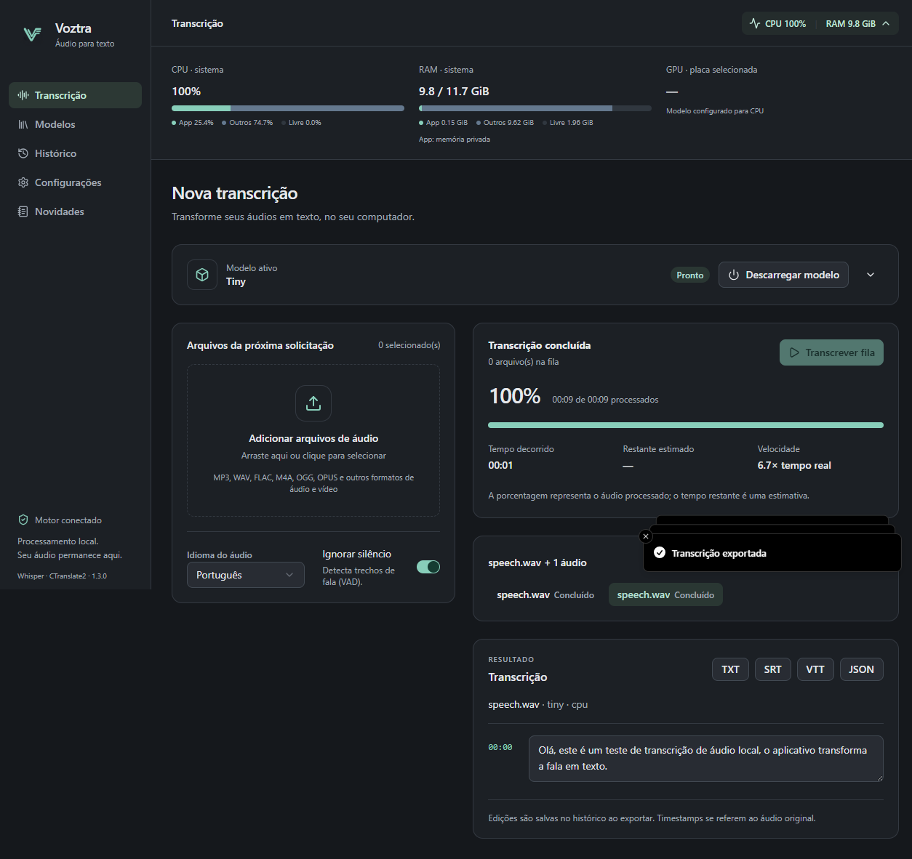

<p align="center"></p>

# Voztra

**Sua voz, em texto. No seu computador.**

Transcrição local com modelos Whisper, controle manual da memória e histórico organizado por solicitação. Antes chamado Transcrevedor.

[Baixar para Windows](https://github.com/gabriexlss/voztra/releases/latest) · [Novidades](CHANGELOG.md) · [Contribuir](CONTRIBUTING.md)

## Instalação

| Distribuição Windows x64            | Uso                                                                                                 |
| ----------------------------------- | --------------------------------------------------------------------------------------------------- |
| `Voztra-1.3.0-win-x64-setup.exe`    | Instala o aplicativo, cria atalhos e permite baixar atualizações pelo próprio Voztra.               |
| `Voztra-1.3.0-win-x64-portable.exe` | Um executável sem instalação. Salva histórico, modelos e preferências na pasta `data` ao lado dele. |

Python e as bibliotecas de áudio já estão incluídos. Modelos são baixados separadamente pela aba **Modelos**. Para atualizar o portable, feche o app e substitua o executável, mantendo a pasta `data`. O runtime portable é extraído temporariamente na inicialização.

Se você usa Transcrevedor 1.0–1.2, instale a versão 1.3 manualmente uma vez. O Voztra instalado mantém os dados em `%APPDATA%/transcrevedor`; seus modelos e histórico continuam disponíveis. A edição portable tem dados independentes.

As builds atuais não possuem certificado comercial de assinatura. Confira `SHA256SUMS.txt` na release.

**Linux x64:** a release também oferece AppImage e `.deb`, gerados e testados em Ubuntu 22.04 no GitHub Actions. No AppImage, conceda permissão de execução (`chmod +x Voztra-1.3.0-linux-x86_64.AppImage`) e abra o arquivo. O pacote `Voztra-1.3.0-linux-amd64.deb` pode ser instalado pelo gerenciador de pacotes. A pasta de dados continua `~/.config/transcrevedor`. Atualizações Linux são baixadas manualmente pela página de releases; outros ambientes gráficos e distribuições não foram validados.

## Recursos



- Modelos tiny, base, small, medium, large-v1/v2/v3 e turbo, com comparações e estimativas de memória.
- CPU e NVIDIA CUDA, com compute types compatíveis detectados no dispositivo.
- Download antecipado, exclusão de modelos e carregamento/descarregamento manual.
- Progresso por segmentos, tempo decorrido, velocidade e estimativa de conclusão.
- Histórico por solicitação, vários áudios, edição e exportação TXT/SRT/VTT/JSON.
- Recursos do aplicativo e do sistema, temas claro/escuro e navegação por teclado.
- Novidades offline e consulta automática de atualizações configurável.

## Tecnologia

Aplicativo desktop de transcrição local com **Electron + React/Vite + TypeScript** e **Python + faster-whisper**. Base criada com o gerador oficial `npm create @quick-start/electron@latest . -- --template react-ts`.

## Desenvolvimento

Requisitos: Node.js 22.12+ e Python 3.11–3.14. Nesta máquina foi utilizado Python 3.14 no Windows x64. As dependências nativas precisam ter wheels disponíveis para a plataforma escolhida.

```sh
npm ci
npm run setup:python
npm run dev
```

O script de setup cria `.venv` na raiz. Para indicar outro interpretador durante o setup, configure `TRANSCREVEDOR_PYTHON` com seu caminho absoluto. Durante a execução, essa variável também substitui o Python da `.venv`.

## Uso

1. Abra **Modelos** e baixe o modelo desejado, sem precisar importar áudio.
2. Na aba **Transcrição**, selecione modelo instalado, CPU/GPU, precisão e threads; clique em **Carregar modelo**.
3. Escolha arquivos ou arraste-os para a importação, ajuste idioma/VAD e clique em **Transcrever fila**.
4. Acompanhe os segmentos, o progresso e as barras de uso do aplicativo, outros processos e espaço livre.
5. Exporte TXT, SRT, VTT ou JSON. Após a execução, edite o texto antes de exportar.
6. O modelo permanece carregado entre áudios. Clique em **Descarregar modelo** para liberar sua memória. Para mudar modelo, dispositivo, precisão ou threads, descarregue primeiro.

`tiny` é útil para verificar a instalação rapidamente; `base` é o padrão inicial. Precisão automática escolhe INT8 em CPU e FP16 quando suportado em CUDA. A qualidade varia com o modelo, idioma e gravação.

O aplicativo sempre abre com o modelo descarregado. **Não existe carregamento nem download automático ao transcrever.** Baixar grava os arquivos no disco; carregar aloca RAM e, quando selecionada, VRAM. Descarregar mantém os arquivos instalados e impede novas transcrições; histórico, edição e exportação continuam disponíveis.

O download explícito usa o Hugging Face e conta **arquivos concluídos**, não bytes; o arquivo de pesos pode levar mais tempo. Cancelar mantém os arquivos parciais para uma tentativa posterior. **Consultar tamanho online** busca o tamanho publicado; os valores iniciais são estimativas. **Excluir** pede confirmação e remove somente o cache daquele modelo, descarregando-o antes se necessário. O contador mede bytes lógicos únicos, não a alocação física em clusters do disco.

Depois de instalado, carregar e transcrever funciona offline. Não é necessário instalar FFmpeg separadamente: PyAV inclui as bibliotecas de decodificação.

## Interface e histórico (1.2.0)

A interface usa Tailwind CSS e componentes shadcn/ui sobre Radix, com ícones Lucide. **Configurações → Aparência** oferece Claro, Escuro e Acompanhar sistema, persistidos localmente. Animações respeitam a preferência de movimento reduzido do sistema. O botão de CPU/RAM no cabeçalho expande as barras do sistema e do aplicativo.

**Compute type** mostra descrições e mantém os tipos incompatíveis visíveis, desativados com explicação. Por exemplo, FP16 pode não estar disponível em CPU neste motor. Automático escolhe apenas a precisão: continua sendo necessário clicar em **Carregar modelo**. Antes de carregar, a prévia exibe uma faixa de RAM do motor, a RAM livre aproximada, VRAM de referência em GPU e o pico medido na mesma configuração, quando existente. FP32 não garante transcrição melhor.

**Modelos → Comparar modelos** compara até três modelos. As escalas de qualidade e velocidade (1–5) são editoriais e relativas, não benchmarks. Consulte as descrições, requisitos e teste local para decidir.

Cada clique em **Transcrever fila** cria uma solicitação com todos os arquivos selecionados naquele instante. Arquivos adicionados durante a execução aguardam o próximo clique. Na aba **Histórico**, filtre por nome, status e período, abra a solicitação e renomeie tanto o grupo quanto seus áudios. Renomear altera apenas rótulos no histórico, nunca arquivos no disco. Cada áudio mantém seus próprios segmentos, status e opções. Cancelar encerra também os arquivos ainda na fila daquela solicitação; uma falha individual permite processar os demais.

Na primeira abertura da 1.2.0, o histórico antigo é migrado para a versão 2. O arquivo `history/jobs.json` é mantido intacto e copiado para `jobs.json.backup`; como não existia identificação de lote, cada registro antigo vira uma solicitação individual. Uma versão 2 inválida não é sobrescrita silenciosamente: o aplicativo mostra um erro para preservar os dados.

## Requisitos por modelo e comparação de processador

Em **Modelos**, cada modelo contém requisitos aproximados para CPU ou GPU NVIDIA e para a precisão selecionada: CPU mínima/recomendada com nome, RAM do sistema, RAM do core e VRAM. São referências práticas do projeto para um áudio por vez; não representam mínimos oficiais nem impedem o uso de hardware inferior.

O processador é identificado pelo registro do Windows ou `/proc/cpuinfo` no Linux. Uma base local com 13 CPUs compara pontuações multicore do Geekbench 6, consultadas em 14/09/2026. Variantes como 7600 e 7600X são distintas; modelos desconhecidos mostram **Sem dados suficientes para comparar**. Uma margem de 10% trata pontuações próximas como equivalentes. As fontes podem ser abertas na interface. Não há consulta automática a serviço externo nem previsão de tempo baseada nessas pontuações.

**Consumo observado neste computador** registra o pico de RAM residente do processo Python por modelo/dispositivo/precisão. Inclui o runtime e buffers, não somente os pesos. **Testar desempenho neste computador** executa uma fala sintética curta em português já incluída no aplicativo, com o modelo previamente carregado; apresenta duração, tempo, velocidade e pico de RAM. É uma referência local, não garantia para gravações longas, outros idiomas ou outros ajustes.

## Hardware e plataformas

- **CPU:** Windows e Linux, com tipos numéricos consultados no CTranslate2.
- **GPU:** NVIDIA/CUDA. Requer driver e bibliotecas CUDA/cuDNN compatíveis com a versão de CTranslate2 instalada. O app só oferece capacidades detectadas; uma GPU listada ainda pode falhar ao carregar se faltar uma DLL de execução.
- **AMD/Intel:** use CPU nesta versão. Outro backend será necessário para aceleração dessas placas.
- **Linux:** AppImage/deb construídos em Ubuntu 22.04, com testes da interface empacotada e conexão ao motor Python no GitHub Actions. Transcrição real e testes portable/atualizador foram executados no Windows.

O instalador inclui Python e as dependências do core, mas não os modelos nem o driver NVIDIA. Bibliotecas CUDA do sistema devem estar acessíveis no PATH (Windows) ou no carregador de bibliotecas (Linux).

## Dados e continuidade

Resultados são gravados após cada segmento em `history/history-v2.json`, dentro de `app.getPath('userData')`. O cache fica em `models/` e as medições em `observations.json`, no mesmo diretório. No Windows, normalmente `%APPDATA%/transcrevedor`; no Linux, `~/.config/transcrevedor`. Histórico e medições utilizam troca atômica de arquivo.

Fechar durante uma tarefa exige confirmação. Uma tarefa interrompida preserva seus segmentos e aparece no histórico como **Interrompido** na próxima abertura. Não há retomada automática do ponto exato de inferência: importe novamente para reiniciar. Edições feitas no editor são persistidas quando exportadas.

Consulte [arquitetura](docs/ARQUITETURA.md) e [registro de progresso](docs/PROGRESSO.md) para continuar o desenvolvimento sem depender do histórico da conversa.

## Verificações

```sh
npm run typecheck
npm run lint
npm run test:python
npm run build
npm run test:e2e
npm run test:dev
```

Testes Python rápidos usam áudio sintético e não baixam modelos. Testes Electron exigem ambiente gráfico. O teste de fala real é opcional: gere o WAV com `scripts/create-fixture.ps1` (Windows) ou use uma gravação em português, e defina `REAL_TRANSCRIPTION=1`. Ele exige `.cache/test-data/speech.wav` e a versão longa gerada por `scripts/extend-fixture.py` e o modelo tiny baixado em `.cache/e2e-data/models`.

Defina também `TEST_DOWNLOAD=1` para testar consulta online, download sem áudio, carga e exclusão em uma pasta isolada `.cache/management-*` (~75 MB de rede). Os testes nunca usam o diretório normal de modelos do usuário.

```powershell
$env:REAL_TRANSCRIPTION='1'
$env:TEST_DOWNLOAD='1'
npm run test:e2e
```

## Distribuição

```sh
npm run build:win
# No Linux:
npm run build:linux
```

Cada comando compila a interface, empacota o core com PyInstaller e gera a distribuição em `dist/releases/<versão>/`. `npm run build:unpack` gera uma pasta executável, útil para diagnóstico. O core intermediário fica em `release/core/transcrevedor-core/`. Veja o processo completo de validação, ASAR, bytecode, arquivamento e publicação em [DISTRIBUICAO.md](docs/DISTRIBUICAO.md).

## Limitações conhecidas

- Processamento em blocos de 30 segundos limita a memória, mas palavras próximas da divisão podem perder contexto. O trecho anterior é fornecido como contexto textual.
- O painel mostra porcentagem por trechos concluídos, duração processada, relógio de execução, velocidade e tempo restante estimado. O spinner permanece ativo enquanto o motor trabalha; não avança a porcentagem artificialmente. Arquivos sem duração conhecida usam indicador indeterminado, e 100% só aparece na conclusão. Durante chamadas internas longas, o percentual pode permanecer parado mesmo com o motor ativo.
- CPU do app agrega Electron e Python, normalizada pelo total de CPUs lógicas. RAM do app soma memória privada (USS); quando indisponível, usa RSS e avisa sobre compartilhamento. RAM do core nas medições é RSS, portanto não é diretamente comparável com USS da barra.
- GPU/VRAM mostram totais da placa selecionada e a parcela do app quando NVML fornece dados por processo. Drivers sem esse suporte, incluindo certas configurações WDDM no Windows, mostram **N/D**; não há atribuição inventada de uso. Amostras não são simultâneas e as barras limitam os segmentos à capacidade total.
- Cancelamento é cooperativo. Após dois segundos sem resposta, o core é encerrado para liberar a memória; será necessário carregar o modelo manualmente de novo. Um cancelamento cooperativo pode manter o modelo carregado.
- Não há descarregamento automático por inatividade; fechar o app também encerra o core e libera o modelo. A base de CPUs é pequena e mantida no código, sem API externa de atualização automática.
- Não há diarização, captura de microfone ou tradução nesta versão.
- A fila não iniciada é mantida apenas durante a sessão. Histórico e segmentos já transcritos são persistentes.

## Referências técnicas

- [electron-vite](https://electron-vite.org/guide/)
- [faster-whisper](https://github.com/SYSTRAN/faster-whisper)
- [CTranslate2: instalação e GPU](https://opennmt.net/CTranslate2/installation.html)

Para testar a pasta empacotada, defina também `TRANSCREVEDOR_EXECUTABLE` com o caminho absoluto de `dist/work/1.3.0/win-unpacked/voztra.exe`. `backend/requirements-windows.lock` registra todas as versões Python verificadas no Windows; `requirements.txt` é a entrada portátil.
